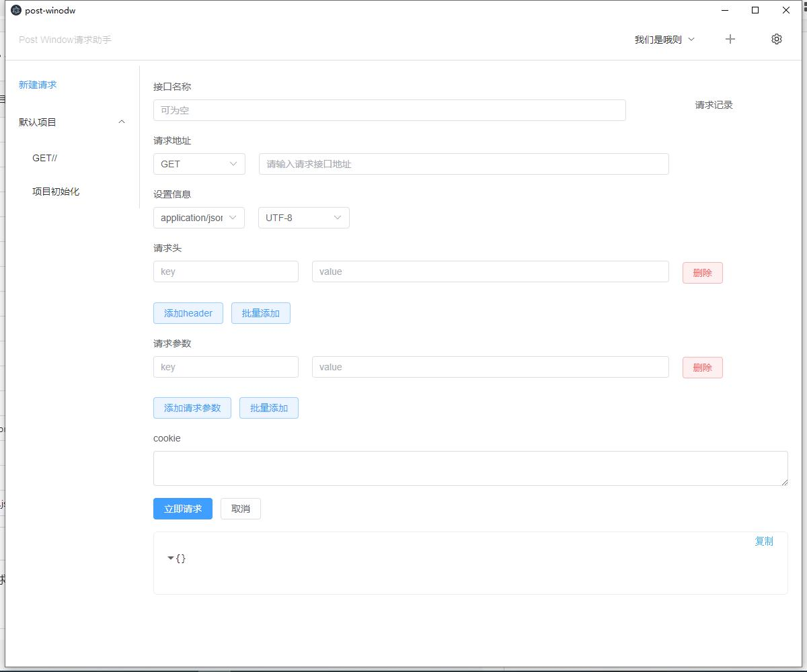

PostWindow 请求模拟器

 
 ## 简介

PostWindow是一个接口测试工具,在做接口测试的时候,PostWindow相当于一个客户端,它可以模拟用户发起的各类HTTP请求,将请求数据发送至服务端,获取对应的响应结果, 从而验证响应中的结果数据是否和预期值相匹配;并确保开发人员能够及时处理接口中的bug,进而保证产品上线之后的稳定性和安全性

## 项目截图




## 开发模式

```
npm run start
```

## 预览

```
npm run dist
```

## 打安装包

```
npm run build
```
